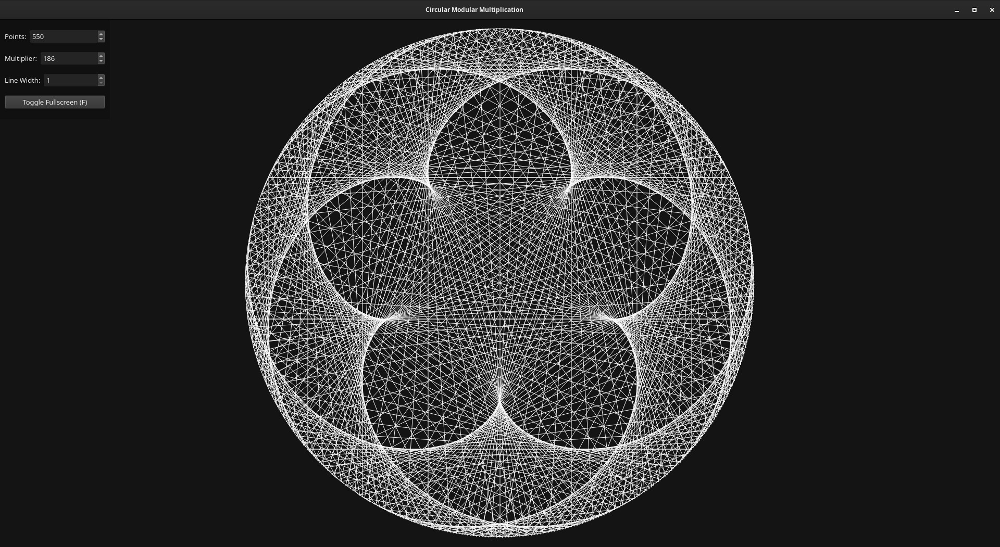

### Circular Modular Multiplication in Qt6
Create beautiful visuals using a simple modular multiplication algorithm. Drag with the mouse to move, use the mouse scroll wheel to zoom in/out.

### Screenshot

### License
GNU General Public License v3.

### Web/JS Version
Web/JS version: https://github.com/yusacetin/cmm_web